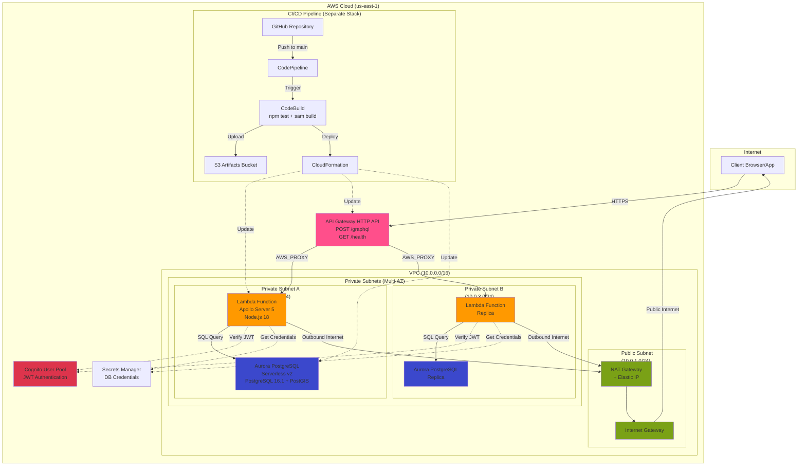

# iw-demo-cfn

A production-ready GraphQL API built with Apollo Server 5, TypeScript, and Aurora PostgreSQL with PostGIS for geospatial queries. This project demonstrates modern serverless architecture patterns, automated CI/CD, comprehensive testing, and infrastructure-as-code using nested CloudFormation stacks on AWS.

## Architecture



This project uses a modular nested CloudFormation stack structure:

- **infrastructure/** - VPC, subnets, NAT Gateway, security groups, Aurora database
- **auth/** - Cognito User Pool for authentication
- **application/** - Lambda function and API Gateway
- **pipeline/** - CI/CD pipeline (CodePipeline + CodeBuild)

The main `template.yaml` orchestrates these nested stacks with proper dependency management.

### Lambda Function

The Lambda function (`lambda/`) is a TypeScript-based GraphQL API server using Apollo Server 5. It connects to Aurora PostgreSQL via VPC networking, verifies JWT tokens from Cognito, and provides a GraphQL endpoint for querying country data. The function includes automatic database seeding with PostGIS sample data on cold starts.

## Deployment

### Initial Bootstrap

The CI/CD pipeline is self-referential (it deploys itself), so it needs to be bootstrapped manually once:

1. **Create the S3 artifact bucket** (if not exists):
   ```bash
   aws s3 mb s3://iw-demo-cfn-artifacts-us-east-1
   ```

2. **Create Aurora credentials secret** (if not exists):
   ```bash
   aws secretsmanager create-secret \
     --name AuroraSecret \
     --secret-string '{"username":"dbadmin","password":"YourSecurePassword123!"}'
   ```

3. **Deploy the pipeline stack manually**:
   ```bash
   aws cloudformation create-stack \
     --stack-name iw-demo-cfn-pipeline \
     --template-body file://pipeline/cicd.yaml \
     --parameters \
       ParameterKey=PipelineBucketName,ParameterValue=iw-demo-cfn-artifacts-us-east-1 \
       ParameterKey=GitHubConnectionArn,ParameterValue=arn:aws:codeconnections:us-east-1:920671455518:connection/3d4db5bf-d87c-47bb-83d8-3faf92ba204e \
       ParameterKey=GitHubRepository,ParameterValue=lillysparks/iw-demo-cfn \
       ParameterKey=GitHubBranch,ParameterValue=main \
       ParameterKey=MainStackName,ParameterValue=iw-demo-cfn \
       ParameterKey=AuroraSecretArn,ParameterValue=<secret-arn> \
     --capabilities CAPABILITY_IAM
   ```

4. **Push to main branch** - The pipeline will automatically build and deploy the main stack

### Continuous Deployment

After bootstrap, every push to the `main` branch triggers:
1. **Source** - CodePipeline pulls latest code from GitHub
2. **Build** - CodeBuild compiles Lambda, uploads nested templates to S3
3. **Deploy** - CloudFormation updates the main stack and all nested stacks

## Development

### Local Testing

```bash
cd lambda
npm ci
npm run build
npm test
```

### GraphQL Endpoint

After deployment, the API is available at:
```
https://<api-id>.execute-api.us-east-1.amazonaws.com/dev/graphql
```

#### Testing Commands

**Set API ID** - Get the API Gateway ID from CloudFormation outputs:
```bash
API_ID=$(aws cloudformation describe-stacks \
  --stack-name iw-demo-cfn \
  --query 'Stacks[0].Outputs[?OutputKey==`GraphQLApiId`].OutputValue' \
  --output text)
```

**Health Check** - Verify the Lambda function is responding:
```bash
curl -X GET https://${API_ID}.execute-api.us-east-1.amazonaws.com/dev/health
```

**Hello Query** - Test basic GraphQL resolver:
```bash
curl -X POST https://${API_ID}.execute-api.us-east-1.amazonaws.com/dev/graphql \
  -H "Content-Type: application/json" \
  -d '{"query":"{ hello }"}'
```

**Countries Query** - Test database connectivity and data seeding:
```bash
curl -X POST https://${API_ID}.execute-api.us-east-1.amazonaws.com/dev/graphql \
  -H "Content-Type: application/json" \
  -d '{"query":"{ countries { id name } }"}'
```

**Nearest Countries Query** - Find 5 nearest countries using PostGIS distance calculation:
```bash
curl -X POST https://${API_ID}.execute-api.us-east-1.amazonaws.com/dev/graphql \
  -H "Content-Type: application/json" \
  -d '{"query":"{ nearestCountries(countryName: \"France\") { id name distance } }"}'
```

**Authenticated Query** - Test with Cognito JWT token:
```bash
curl -X POST https://${API_ID}.execute-api.us-east-1.amazonaws.com/dev/graphql \
  -H "Content-Type: application/json" \
  -H "Authorization: Bearer <your-jwt-token>" \
  -d '{"query":"{ countries { id name } }"}'
```

**Schema Introspection** - View available queries and types:
```bash
curl -X POST https://${API_ID}.execute-api.us-east-1.amazonaws.com/dev/graphql \
  -H "Content-Type: application/json" \
  -d '{"query":"{ __schema { queryType { name fields { name } } } }"}'
```

## Database Seeding

The Lambda function automatically seeds the Aurora database with PostGIS country data on first invocation (cold start). The seed file is downloaded during the build process from the [PostGIS sample dataset](https://github.com/adityatoshniwal/postgis-sample-dataset).

## Future Enhancements

This project demonstrates production-ready patterns, but there are several improvements that could be added:

- **Redis Caching Layer** - Add ElastiCache Redis for query result caching to reduce database load and improve response times for frequently accessed country data
- **Multi-Environment Pipeline** - Extend CI/CD to support dev/staging/production environments with branch-based deployments (feature branches → dev, main → staging, tags → production) and environment-specific parameter files for stack configuration
- **Blue/Green Deployments** - Implement Lambda aliases (blue/prod) with CodeDeploy for gradual traffic shifting and automatic rollback on CloudWatch alarm triggers
- **DataLoader Implementation** - Implement Facebook's DataLoader pattern for batching and caching database queries within a single GraphQL request context
- **GraphQL Subscriptions** - Add WebSocket support for real-time updates using Apollo Server subscriptions
- **Observability Stack** - Integrate AWS X-Ray for distributed tracing and add custom CloudWatch metrics for GraphQL operation performance
- **Schema Federation** - Refactor into federated GraphQL services as complexity grows beyond geospatial queries
- **Rate Limiting** - Implement API Gateway usage plans or GraphQL query complexity analysis to prevent abuse
- **Cost Optimization** - Implement Aurora Serverless v2 auto-pause for non-production environments and add S3 lifecycle policies for artifact cleanup
