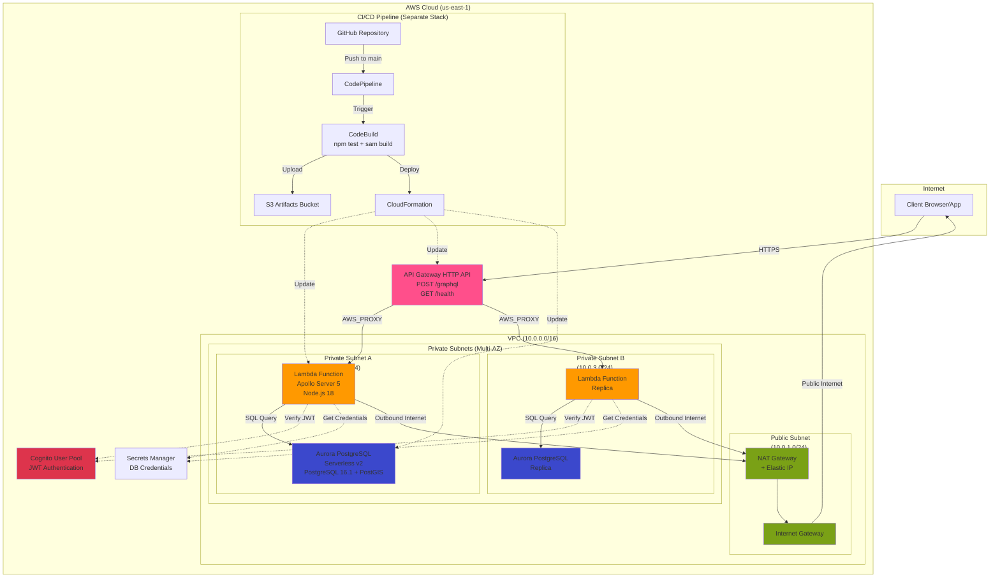

# Architecture Diagram - GraphQL + PostGIS API

## Text Description for Diagram Creation

### High-Level Architecture

```
Internet
    │
    ▼
┌─────────────────────────────────────────────────────────────────┐
│                         AWS Cloud (us-east-1)                    │
│                                                                   │
│  ┌────────────────────────────────────────────────────────────┐ │
│  │                    VPC (10.0.0.0/16)                        │ │
│  │                                                              │ │
│  │  ┌──────────────────────┐  ┌──────────────────────────────┐│ │
│  │  │ Public Subnet        │  │  Private Subnets (Multi-AZ)  ││ │
│  │  │ (10.0.1.0/24)        │  │  • 10.0.2.0/24 (AZ-A)        ││ │
│  │  │                      │  │  • 10.0.3.0/24 (AZ-B)        ││ │
│  │  │  ┌───────────────┐   │  │                              ││ │
│  │  │  │  NAT Gateway  │   │  │  ┌────────────────────────┐ ││ │
│  │  │  │  + Elastic IP │◄──┼──┼──│  Lambda Function       │ ││ │
│  │  │  └───────────────┘   │  │  │  (Apollo Server 5)     │ ││ │
│  │  │         ▲            │  │  │  • Node.js 18          │ ││ │
│  │  └─────────┼────────────┘  │  │  • GraphQL Handler     │ ││ │
│  │            │               │  │  • TypeScript          │ ││ │
│  │  ┌─────────┼────────────┐  │  └──────────┬─────────────┘ ││ │
│  │  │  Internet Gateway    │  │             │               ││ │
│  │  └─────────▲────────────┘  │  ┌──────────▼─────────────┐ ││ │
│  │            │               │  │  Aurora PostgreSQL     │ ││ │
│  └────────────┼───────────────┼──│  Serverless v2         │ ││ │
│               │               │  │  • PostgreSQL 16.1     │ ││ │
│  ┌────────────┼───────────────┘  │  • PostGIS extension   │ ││ │
│  │            │                  │  • Multi-AZ cluster    │ ││ │
│  │  ┌─────────┴────────────┐     └────────────────────────┘ ││ │
│  │  │  API Gateway (HTTP)  │                                ││ │
│  │  │  • POST /graphql     │◄───────────────────────────────┘│ │
│  │  │  • GET  /health      │                                  │ │
│  │  └──────────────────────┘                                  │ │
│  │                                                              │ │
│  └──────────────────────────────────────────────────────────────┘ │
│                                                                   │
│  ┌──────────────────────┐  ┌──────────────────────────────────┐ │
│  │  Cognito User Pool   │  │  Secrets Manager                 │ │
│  │  • JWT Auth          │  │  • DB Credentials                │ │
│  │  • User Management   │  │  • Auto-rotation capable         │ │
│  └──────────────────────┘  └──────────────────────────────────┘ │
│                                                                   │
│  ┌───────────────────────────────────────────────────────────┐  │
│  │              CI/CD Pipeline (Separate Stack)               │  │
│  │                                                             │  │
│  │  GitHub ──► CodePipeline ──► CodeBuild ──► CloudFormation │  │
│  │              (Trigger)        (Test+Build)   (Deploy)      │  │
│  │                                   │                         │  │
│  │                                   ▼                         │  │
│  │                              S3 Artifacts                   │  │
│  │                       (SAM templates + Lambda code)         │  │
│  └───────────────────────────────────────────────────────────┘  │
│                                                                   │
└───────────────────────────────────────────────────────────────────┘
```

---

## Detailed Component Breakdown

### 1. **Client Layer**
- **Entry Point**: HTTPS requests to API Gateway
- **Endpoint**: `https://umurmhmr3h.execute-api.us-east-1.amazonaws.com/dev/graphql`

### 2. **API Layer**
- **API Gateway (HTTP API)**
  - Routes: `POST /graphql`, `GET /health`
  - Protocol: HTTP (not REST)
  - Integration: AWS_PROXY to Lambda
  - Stage: `dev` with auto-deploy enabled

### 3. **Compute Layer**
- **Lambda Function** (Node.js 18, TypeScript)
  - **Framework**: Apollo Server 5
  - **Runtime**: 512MB memory, 30s timeout
  - **VPC Integration**: Deployed in private subnets (multi-AZ)
  - **Security**: Custom security group, IAM role with least privilege
  - **Environment Variables**:
    - Database connection (host, port, credentials from Secrets Manager)
    - Cognito configuration (user pool ID, client ID, issuer)
  
### 4. **Data Layer**
- **Aurora PostgreSQL Serverless v2**
  - **Version**: 16.1
  - **Extensions**: PostGIS (geospatial queries)
  - **Deployment**: Multi-AZ cluster in private subnets
  - **Scaling**: Auto-scales based on load (ACU: 0.5 - 1.0)
  - **Security**: Custom security group, encrypted at rest
  - **Connection**: Accessed via Lambda in same VPC

### 5. **Network Layer**
- **VPC** (10.0.0.0/16)
  - **Public Subnet** (10.0.1.0/24): NAT Gateway + Internet Gateway
  - **Private Subnet A** (10.0.2.0/24, AZ-1): Lambda + Aurora
  - **Private Subnet B** (10.0.3.0/24, AZ-2): Lambda + Aurora (HA)
  - **Routing**:
    - Public subnet → Internet Gateway (outbound internet)
    - Private subnets → NAT Gateway → Internet Gateway (Lambda outbound only)
  - **DNS**: Enabled for VPC and hostnames

### 6. **Security Layer**
- **Security Groups**:
  - Lambda SG: Outbound to Aurora on port 5432
  - Aurora SG: Inbound from Lambda SG on port 5432
- **Cognito User Pool**:
  - JWT token verification in Lambda context
  - Authentication for GraphQL queries
- **Secrets Manager**:
  - Database credentials (username/password)
  - Accessed by Lambda via IAM role
  - Dynamic secret resolution in CloudFormation

### 7. **CI/CD Layer**
- **CodePipeline** (separate stack, not nested)
  - **Source**: GitHub repository (`main` branch)
  - **Build**: CodeBuild
    - Steps: `npm install` → `npm test` → `sam build` → `sam deploy`
    - Tests block deployment on failure
  - **Deploy**: CloudFormation (SAM)
    - Nested stack deployment (infrastructure → auth → application)
  - **Artifacts**: S3 bucket for templates and Lambda code

---

## Data Flow

### GraphQL Query Flow
```
1. Client sends POST request
   ↓
2. API Gateway receives request
   ↓
3. API Gateway invokes Lambda (AWS_PROXY)
   ↓
4. Lambda extracts JWT from headers
   ↓
5. Lambda verifies JWT with Cognito
   ↓
6. Apollo Server parses GraphQL query
   ↓
7. Resolver executes (e.g., nearestCountries)
   ↓
8. Lambda connects to Aurora via VPC
   ↓
9. PostgreSQL executes SQL with PostGIS functions
   ↓
10. Results returned to resolver
    ↓
11. Apollo Server formats GraphQL response
    ↓
12. Lambda returns response to API Gateway
    ↓
13. API Gateway returns to client
```

### Deployment Flow
```
1. Developer pushes to GitHub main branch
   ↓
2. CodePipeline detects change (webhook)
   ↓
3. CodeBuild pulls source code
   ↓
4. buildspec.yml executes:
   - npm install (dependencies)
   - npm test (Jest unit tests)
   - sam build (compile TypeScript, package Lambda)
   ↓
5. SAM uploads artifacts to S3
   ↓
6. CloudFormation updates nested stacks:
   - Infrastructure (network → security → database)
   - Auth (Cognito)
   - Application (Lambda → API Gateway)
   ↓
7. Lambda function updated with new code
   ↓
8. API Gateway routes to new Lambda version
```

---

## Stack Dependencies

```
Main Stack (template.yaml)
├── NetworkStack (infrastructure/network.yaml)
│   └── Outputs: VPCId, PublicSubnetA, PrivateSubnetA, PrivateSubnetB
│
├── SecurityStack (infrastructure/security.yaml)
│   ├── DependsOn: NetworkStack
│   └── Outputs: LambdaSecurityGroupId, AuroraSecurityGroupId
│
├── DatabaseStack (infrastructure/database.yaml)
│   ├── DependsOn: NetworkStack, SecurityStack
│   └── Outputs: AuroraClusterEndpoint, AuroraInstanceEndpoint, AuroraInstancePort
│
├── AuthStack (auth/cognito.yaml)
│   └── Outputs: UserPoolId, UserPoolClientId, UserPoolIssuer
│
├── LambdaStack (application/lambda.yaml)
│   ├── DependsOn: NetworkStack, SecurityStack, DatabaseStack, AuthStack
│   └── Outputs: LambdaArn, LambdaName
│
└── ApiStack (application/api.yaml)
    ├── DependsOn: LambdaStack
    └── Outputs: ApiEndpoint, ApiId

Pipeline Stack (pipeline/cicd.yaml) - Deployed separately
├── CodePipeline
├── CodeBuild
└── S3 Artifact Bucket
```

---

## Key Architectural Decisions

### 1. **Nested CloudFormation Stacks**
- **Why**: Modular, reusable infrastructure components
- **Benefit**: Independent updates, clear separation of concerns
- **Trade-off**: More complex dependency management

### 2. **VPC with NAT Gateway**
- **Why**: Lambda needs VPC access for Aurora, but also internet for Cognito/Secrets Manager
- **Benefit**: Secure database in private subnet, controlled internet access
- **Trade-off**: NAT Gateway cost (~$32/month)

### 3. **Aurora Serverless v2**
- **Why**: Auto-scaling, pay-per-use, no cold starts (vs RDS)
- **Benefit**: Cost-effective for variable load, production-ready HA
- **Trade-off**: Slightly higher complexity than RDS

### 4. **Apollo Server in Lambda**
- **Why**: Serverless GraphQL, no server management
- **Benefit**: Auto-scaling, pay-per-request, integrates with API Gateway
- **Trade-off**: Cold starts (mitigated with provisioned concurrency if needed)

### 5. **PostGIS Extension**
- **Why**: Geospatial queries (ST_Distance, ST_Centroid)
- **Benefit**: Efficient distance calculations at scale
- **Use Case**: `nearestCountries` query uses geographic calculations

### 6. **Cognito for Auth**
- **Why**: Managed JWT authentication
- **Benefit**: No custom auth logic, OIDC/OAuth2 compatible
- **Integration**: JWT verified in Lambda context builder

### 7. **Secrets Manager vs Parameter Store**
- **Why**: Automatic rotation support, audit logging
- **Benefit**: Secure credential management with CloudFormation dynamic references
- **Trade-off**: Slightly more expensive than Parameter Store

---

## Resource Count Summary

- **VPC Resources**: 1 VPC, 3 subnets, 1 NAT Gateway, 1 Internet Gateway, 2 route tables
- **Compute**: 1 Lambda function
- **Database**: 1 Aurora Serverless v2 cluster (multi-AZ)
- **API**: 1 API Gateway HTTP API
- **Auth**: 1 Cognito User Pool + 1 App Client
- **Security**: 2 security groups, 1 IAM role, 1 Secrets Manager secret
- **CI/CD**: 1 CodePipeline, 1 CodeBuild project, 1 S3 bucket

---

## How to Create a Visual Diagram

### Option 1: Use this text in ChatGPT/Claude
Paste this entire description and ask:
```
"Create a Mermaid diagram of this architecture"
```

### Option 2: Use draw.io
1. Go to https://app.diagrams.net/
2. Use AWS shape library (More Shapes → AWS Architecture)
3. Drag components matching the text description above
4. Follow the data flow arrows

### Option 3: Use Cloudcraft
1. Go to https://www.cloudcraft.co/
2. Drag AWS components (VPC, Lambda, RDS, API Gateway, etc.)
3. Connect them according to the architecture above
4. Export as PNG/PDF

### Option 4: Use Mermaid (code-based)
See below for a Mermaid diagram you can paste into GitHub, VS Code (with extension), or online editors.

---

## Mermaid Diagram (Copy-Paste Ready)



---

## Quick Stats

- **Total AWS Services**: 10 (VPC, API Gateway, Lambda, Aurora, Cognito, Secrets Manager, CodePipeline, CodeBuild, CloudFormation, S3)
- **Total CloudFormation Stacks**: 6 nested stacks + 1 pipeline stack
- **Lines of IaC**: ~1000 lines of YAML across all templates
- **Lambda Code**: ~500 lines of TypeScript
- **Deployment Time**: ~15 minutes (full stack from scratch)
- **Cost Estimate**: ~$50-75/month (mostly Aurora + NAT Gateway)
